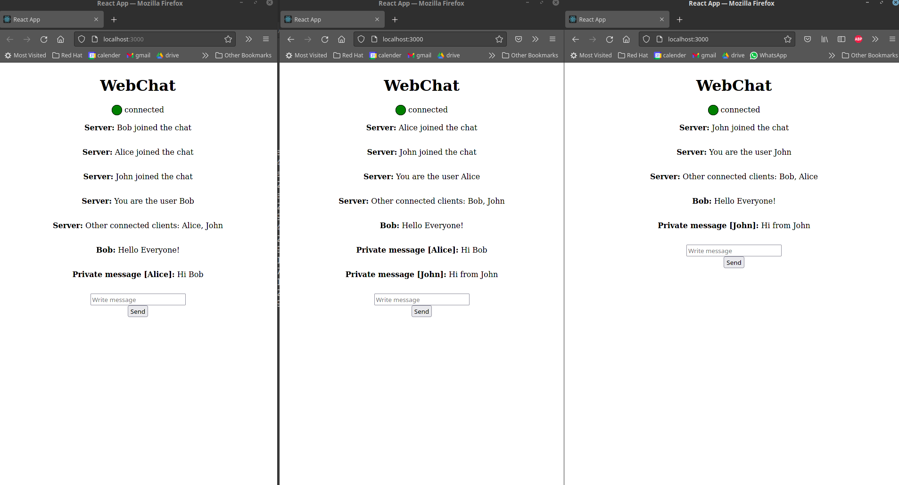
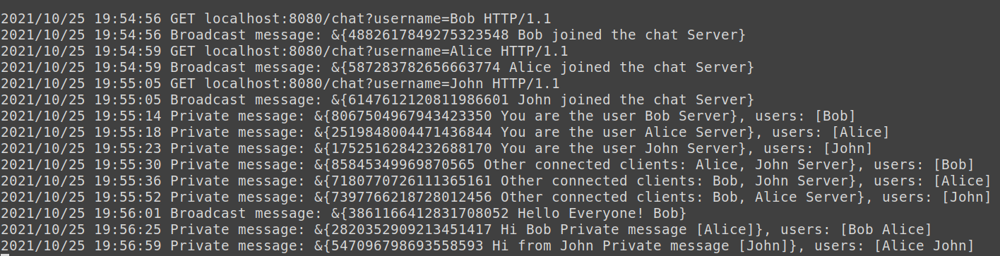

# Web-Chat-Server

Web-Chat-Server is a chat server based on react JS as its frontend and GoLang 
as its backend. 

Web-Chat-Server is based on web sockets where each client connects to the server with 
a web socket currently on the local machine. 





### Prerequisites

1) Javascript Package Manager should be installed - 
https://docs.npmjs.com/downloading-and-installing-node-js-and-npm

2) Go complier should be installed - https://golang.org/dl/

Simple guide to setup Golang in your mac/linux:

https://gist.github.com/sathiyaseelan/529695891e290991573d278a56180535

### Web-Chat-Server Requirements 

1) Client will be able to connect to the web-chat-server and choose its nick name.
2) Client will be able to send messages to all of the other clients that are connected to the server.
3) Client will be able to leave the server whenever he wishes.
4) Client will be able to get information about which clients are connected to the server (except himself)
5) Client will be able to check what his username is.
6) Client will be able to send private messages to any other client he wishes as long as that client is connected to the chat server.
7) Client will get default name if the client chooses to leave the nick name empty


### Running Web-Chat-Server

Simply run the following script:

```
./RunChatServer.sh
```

In order to stop, simply run the following script:

```
./StopChatServer.sh
```

### Commands

Clients can run commands in the web-chat-server,
this is demonstrated in the video below.

All the commands in the server are starting with a question mark (!).
If the message does not start with a question mark, it will be automaticlly broadcasted as 
a message to all the rest of the clients that are connected to the server. 

Who am I? ---> Server will return the username of the client running that command.
```
!whoami
```

Who is with me? ---> Server will return all the clients (usernames) that are connected to the server.
```
!whoiswithme
```

!privatemessage ---> send private message to other clients.
```
!privatemessage:<username1:username2>...:<message>
!privatemessage:alice:john:Hi Alice and John :-)
```
### Running Video Example

https://user-images.githubusercontent.com/53861351/138741339-059b10b7-0d08-498d-85af-966dd4b6bba1.mp4

### Notes

This is not a production server, so do not use it for that matter.